# Anleitung für Admins – Find Your Way

## 🎮 Willkommen im Admin-Bereich!

Als Admin seid ihr die **Kontrollzentrale** des Spiels. Ihr verwaltet Teams, bestätigt Stationen, moderiert den Chat und überwacht den Timer. Diese Anleitung zeigt euch alles, was ihr wissen müsst.

**Wichtige Rollen:**
- 🎮 **Spielleitung:** Timer starten, Fortschritt überwachen
- ✅ **Stationen-Bestätigung:** Aktive Stationen überprüfen und freigeben
- 💬 **Chat-Moderation:** Mit Teams kommunizieren
- 👥 **Teilnehmer-Verwaltung:** Teams und Spieler verwalten

---

## 1️⃣ Anmelden – Admin-Bereich

### Schritt für Schritt

1. **Admin-Seite öffnen**
   - Öffnet einen Browser auf eurem Computer
   - Gebt die Adresse ein: `https://fyw.tncg.de/admin`
   - Die Admin-Anmeldung sollte erscheinen

   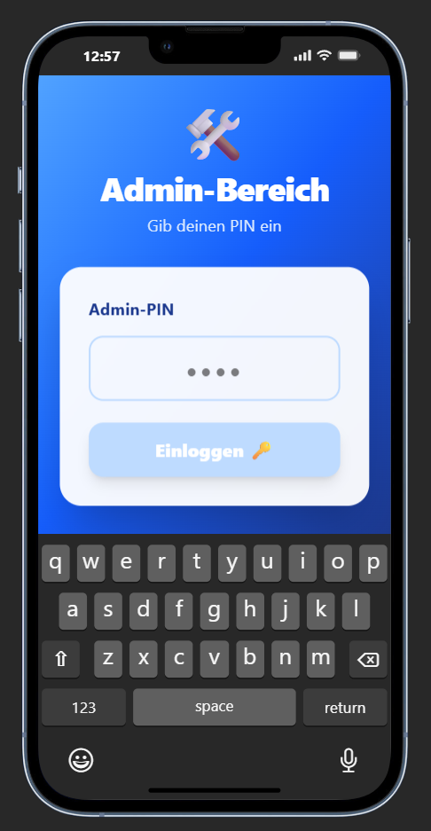

2. **PIN eingeben**
   - Standard-PIN: `1234`
   - Gebt die PIN in das Eingabefeld ein
   - **Wichtig:** Die PIN kann in der Konfiguration geändert werden

   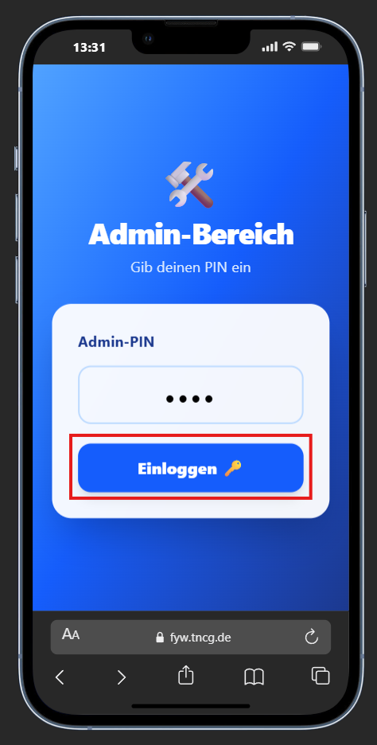

3. **"Einloggen 🔑" drücken**
   - Klickt auf den Button
   - Der Admin-Bereich lädt

   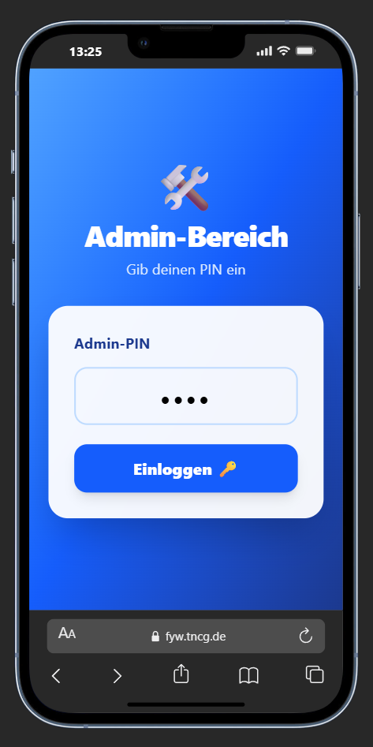

4. **Ihr seid angemeldet!**
   - Ihr seht das Admin-Dashboard
   - Die Uhr und die Rangliste sind sichtbar

   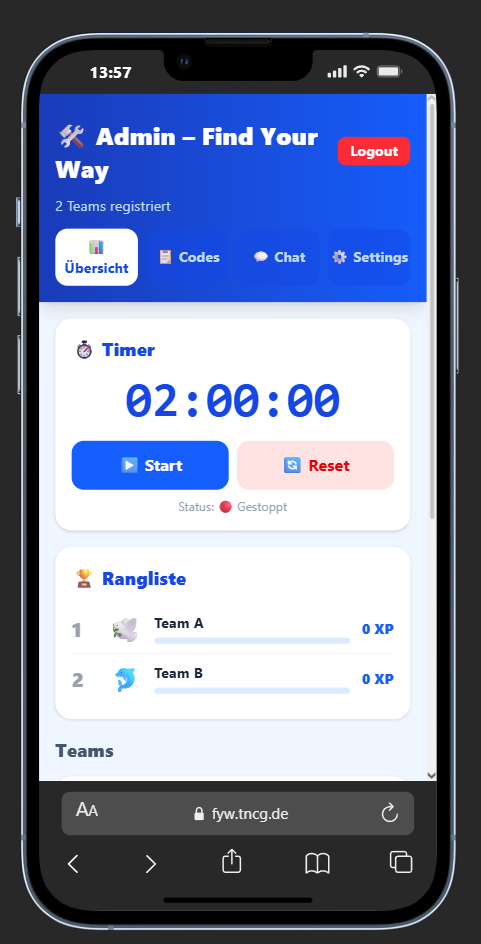

### ⚠️ Sicherheit

- **PIN schützen:** Teilt die PIN nicht mit Teilnehmern!
- **Admin-Bereich sperren:** Wenn ihr nicht am Computer seid, loggt euch aus

---

## 2️⃣ Das Admin-Dashboard verstehen

### Oben: Die Uhr

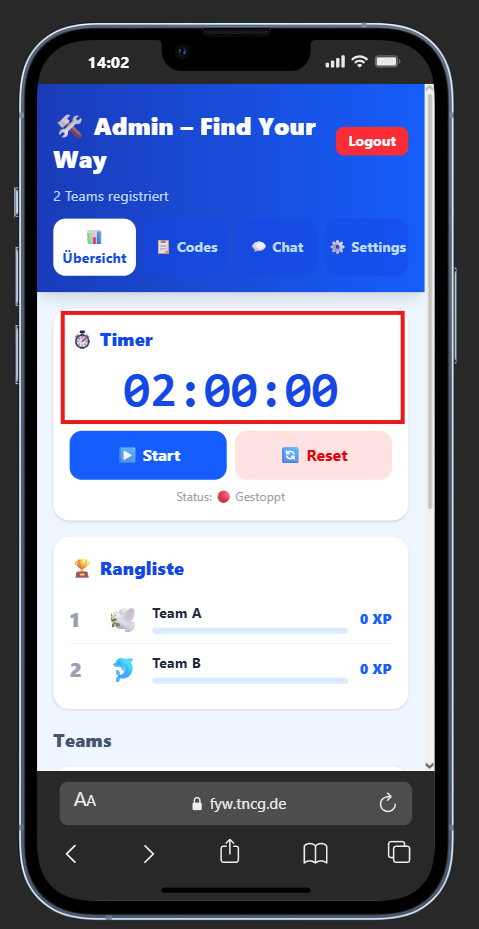

```
⏱ 2:00:00
```

- **Zeigt die verbleibende Spielzeit**
- **Grün:** Alles normal (mehr als 10 Minuten)
- **Gelb:** Warnung (5-10 Minuten)
- **Rot:** Letzte 10 Minuten! 🔴

### Timer-Buttons

```
[▶ Start] [⏸ Pause] [🔄 Reset]
```

| Button | Funktion | Wann nutzen |
|--------|----------|-----------|
| **▶ Start** | Startet den 2-Stunden-Timer | Am Anfang des Spiels |
| **⏸ Pause** | Pausiert den Timer | Bei technischen Problemen |
| **🔄 Reset** | Setzt den Timer auf 2:00:00 zurück | Wenn ihr neu starten wollt |

<div style="display: flex; gap: 10px;">
  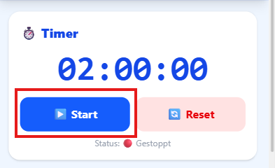
  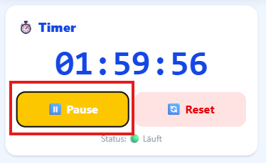
  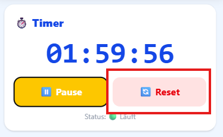
</div>

### Statistik-Boxen

```
📊 Teams: 5
👥 Teilnehmer: 23
✅ Fertig: 1
📈 Ø Fortschritt: 42%
```

- **Teams:** Wie viele Teams spielen gerade
- **Teilnehmer:** Gesamtzahl aller Spieler
- **Fertig:** Wie viele Teams alle Stationen erledigt haben
- **Ø Fortschritt:** Durchschnittlicher Fortschritt aller Teams

### Rangliste

Die Rangliste zeigt alle Teams sortiert nach Punkten (Hierbei handelt es sich hier um Beispiele)


```
1. 🏆 Team C (90 XP) – 3/12 Stationen
2. 🥇 Team B (70 XP) – 2/12 Stationen
3. 🥈 Team A (40 XP) – 2/12 Stationen
```

- **Platz:** Aktuelle Rangliste
- **Team-Name + Icon:** Der Name und das Icon des Teams
- **Punkte:** Aktuelle XP des Teams
- **Stationen:** Wie viele Stationen erledigt / gesamt

### Team-Karten

Unter der Rangliste seht ihr **Team-Karten** mit Details:

```
🌊 Team C (6 Spieler)
Fortschritt: 3/12 (25%)
Punkte: 90/390 XP

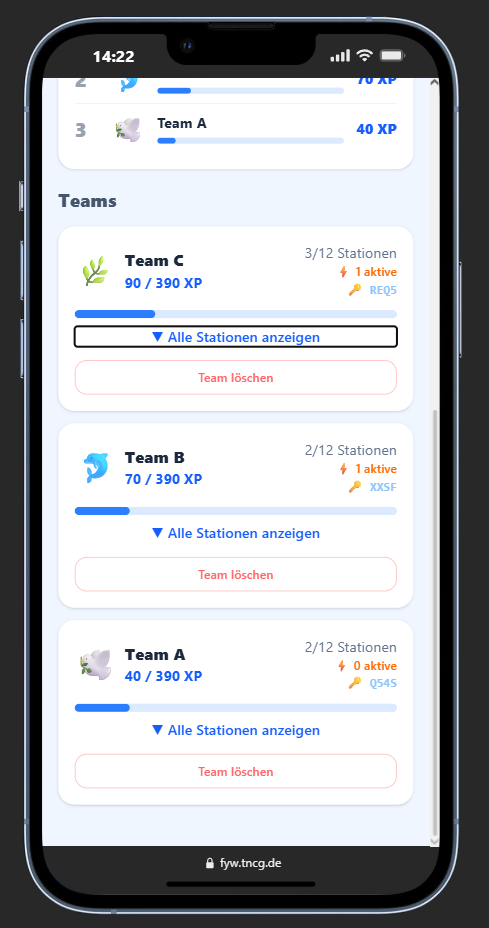

[▼ Expandieren]
```

- **Team-Name + Icon:** Der Name und das Icon
- **Spieler:** Wie viele Spieler im Team sind
- **Fortschritt:** Stationen erledigt / gesamt
- **Punkte:** Aktuelle XP
- **▼ Expandieren:** Klickt hier, um mehr Details zu sehen

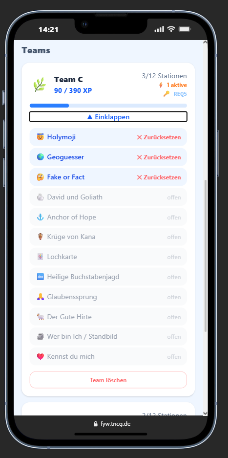

---

## 3️⃣ Aktive Stationen bestätigen

### Die gelbe Box

Wenn ein Team eine aktive Station erledigt hat, seht ihr eine **gelbe Box** auf der Team-Karte:

```
⏳ Station "David gegen Goliath" wartet auf Bestätigung
[✓ OK] [✕ Nein]
```

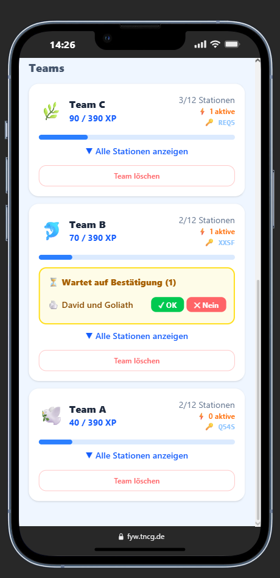

Das bedeutet: Das Team hat die Aufgabe erledigt und wartet auf eure Bestätigung.

### Bestätigung – Schritt für Schritt

1. **Überprüft die Lösung**
   - Der Betreuer vor Ort überprüft die Lösung des Teams
   - Ist die Lösung richtig?

2. **"✓ OK" drücken** (wenn richtig)
   - Klickt auf den grünen Button "✓ OK"
   - Die Station wird freigeschaltet
   - Das Team bekommt +50 XP
   - Die gelbe Box verschwindet
   - Die Karte wird grün

3. **"✕ Nein" drücken** (wenn falsch)
   - Klickt auf den roten Button "✕ Nein"
   - Die Station wird zurückgesetzt
   - Das Team bekommt keine Punkte
   - Das Team kann die Station nochmal versuchen
   - Die gelbe Box verschwindet

---

## 4️⃣ Codes-Tab – Station-Codes ausdrucken

### Zugang zum Codes-Tab

1. **Oben im Admin-Bereich:** Klickt auf den Tab "📋 Codes"
2. **Alle Codes werden angezeigt**

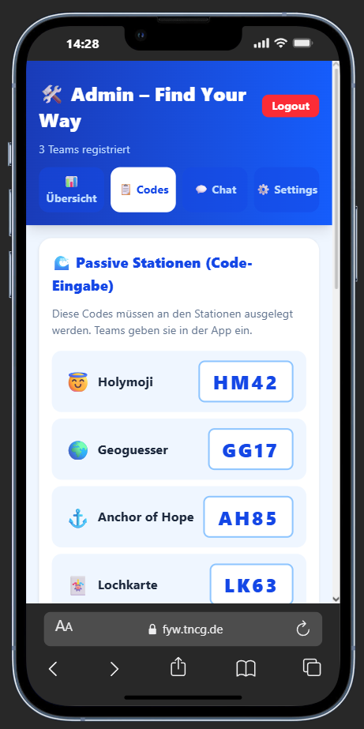

### Codes für passive Stationen

Diese Codes können **ausgedruckt und bei den Stationen ausgelegt** oder **in den Stationen am Ende integriert** werden:

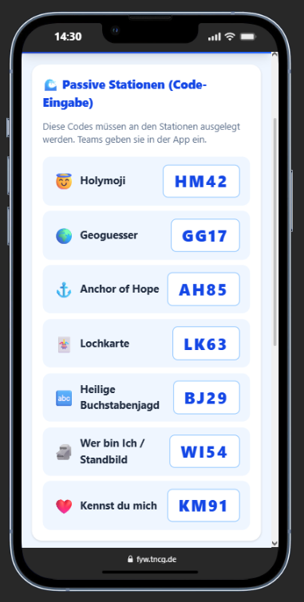

### Codes für aktive Stationen

Diese Stationen haben **keinen Code** – ein Betreuer steht vor Ort:

- Fake or Fact
- David und Goliath
- Krüge von Kana
- Glaubenssprung
- Der Gute Hirte

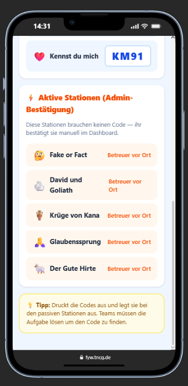

---

## 5️⃣ Chat-Tab – Mit Teams kommunizieren

### Zugang zum Chat

1. **Oben im Admin-Bereich:** Klickt auf den Tab "💬 Chat"
2. **Liste aller Teams wird angezeigt**

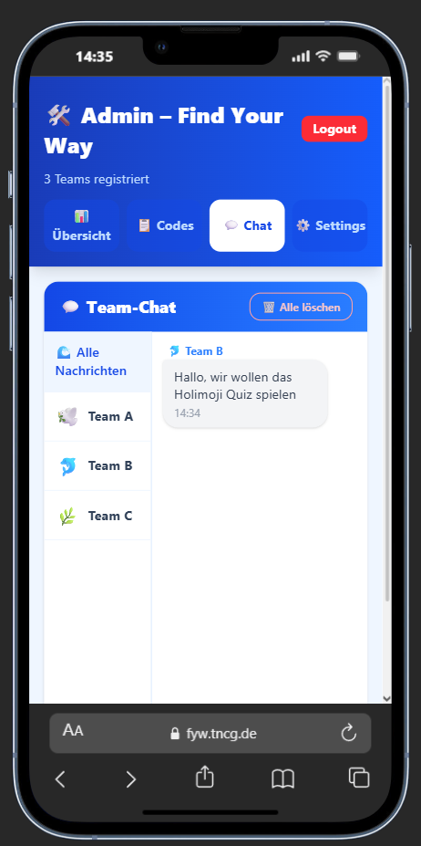

### Mit einem Team chatten

1. **Team auswählen**
   - Klickt auf ein Team in der Liste
   - Die Chat-Nachrichten des Teams werden angezeigt

2. **Nachrichten lesen**
   - Ihr seht alle Nachrichten des Teams
   - Neue Nachrichten erscheinen automatisch

3. **Antwort schreiben**
   - Klickt in das Eingabefeld unten
   - Schreibt eure Antwort (max. 200 Zeichen)
   - Beispiel: "Schaut nochmal bei der Station nach!"

4. **"➤" drücken zum Senden**
   - Klickt auf den Pfeil-Button
   - Die Nachricht wird sofort gesendet
   - Das Team sieht die Antwort sofort

### Alle Nachrichten löschen

1. **Oben rechts:** Klickt auf "🗑 Alle löschen"
2. **Bestätigung erforderlich**
3. **Alle Chat-Nachrichten werden gelöscht**

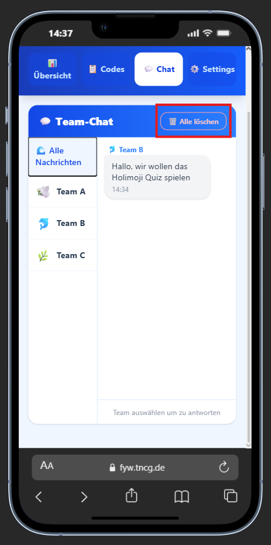


**Wann nutzen?**
- Am Ende des Events
- Wenn der Chat zu voll wird
- Zur Datenschutz-Hygiene

---

## 6️⃣ Häufige Aufgaben

### Spiel starten

1. **Admin-Dashboard öffnen**
2. **"▶ Start" drücken**
3. **Timer läuft** (2 Stunden)
4. **Teams können spielen**

### Spiel pausieren

1. **"⏸ Pause" drücken**
2. **Timer stoppt**
3. **Teams können nicht mehr spielen**
4. **"▶ Start" drücken zum Weitermachen**

### Spiel neu starten

1. **"🔄 Reset" drücken**
2. **Timer wird auf 2:00:00 zurückgesetzt**
3. **"▶ Start" drücken zum Starten**

### Station bestätigen

1. **Gelbe Box sehen**
2. **Lösung überprüfen**
3. **"✓ OK" oder "✕ Nein" drücken**

### Mit Team chatten

1. **Chat-Tab öffnen**
2. **Team auswählen**
3. **Nachricht schreiben**
4. **"➤" drücken**

### Team löschen

1. **Control Board öffnen**
2. **Team expandieren**
3. **"Team löschen" drücken**
4. **Bestätigung erforderlich**

---

## 8️⃣ Häufige Probleme & Lösungen

| Problem | Ursache | Lösung |
|---------|--------|--------|
| Admin-Bereich lädt nicht | Verbindungsproblem | Browser neu laden (F5) |
| PIN funktioniert nicht | Falsche PIN | PIN überprüfen (Standard: `1234`) |
| Codes nicht sichtbar | Falscher Tab | Auf "📋 Codes" Tab klicken |
| Chat-Nachrichten kommen nicht an | Verbindungsproblem | Seite neu laden |
| Timer läuft nicht | Timer nicht gestartet | "▶ Start" drücken |
| Gelbe Box verschwindet nicht | Bestätigung nicht registriert | Seite neu laden |
| Team wird nicht angezeigt | Team hat sich nicht angemeldet | Warten oder Team-Code überprüfen bei einem Admin |

### Schnelle Hilfe

**Etwas funktioniert nicht?**

1. **Seite neu laden** (F5)
2. **Browser neu starten**
3. **Warten und nochmal versuchen**
4. **Backend neu starten** (falls nötig)

Wenn das nicht hilft, kontaktiert den technischen Support.

---

Viel Erfolg beim Event! 🌊⚓
