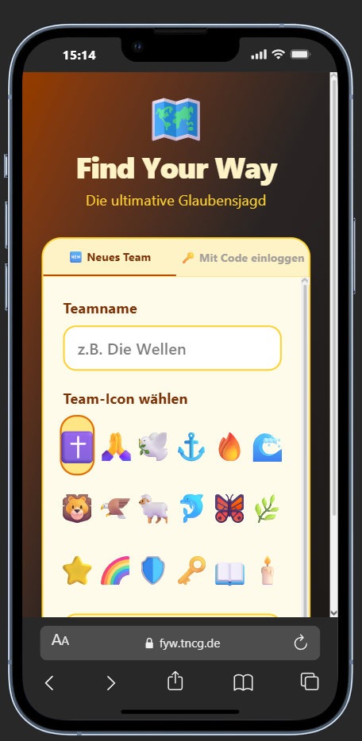
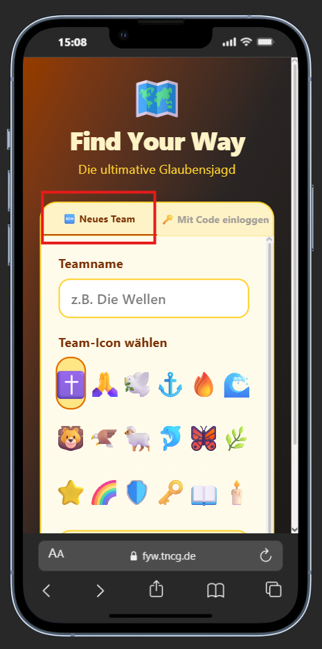
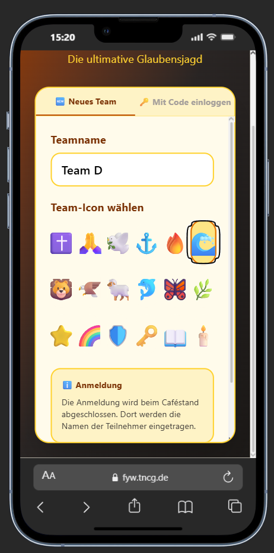
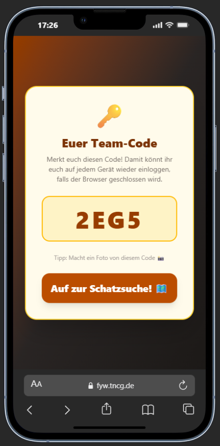

# Anleitung für Teilnehmer – Find Your Way

## 🎮 Willkommen zur Glaubensjagd!

**Find Your Way** ist eine spannende Schnitzeljagd mit 12 Stationen rund um Glaubensthemen. Ihr sammelt Punkte (XP), arbeitet als Team zusammen und konkurriert mit anderen Teams um die höchste Punktzahl.

**Spielzeit:** 2 Stunden  
**Max. Punkte:** 390 XP  
**Teams:** Unbegrenzt  
**Geräte:** Smartphone, Tablet oder Computer

---

## 1️⃣ Team erstellen – So geht's

### Schritt für Schritt

1. **App öffnen**
   - Öffnet einen Browser auf eurem Smartphone/Tablet
   - Gebt die Adresse ein: `https://fyw-tncg.de` 
   - Die Startseite sollte automatisch laden 

   

2. **Tab "🆕 Neues Team" auswählen**
   - Oben seht ihr mehrere Tabs
   - Klickt auf den Tab mit dem Emoji "🆕 Neues Team"
   - Falls nicht sichtbar, scrollt nach links

   

3. **Teamname eingeben und Team-Icon wählen**
   - Gebt einen kreativen Namen ein (z.B. "Die Wellen", "Glaubenskrieger", "Team Hoffnung")
   - Der Name wird auf der Rangliste angezeigt
   - Max. 20 Zeichen
   - Das Icon wird neben eurem Teamnamen angezeigt

   

4. **"Spiel starten 🌊" drücken**
   - Klickt auf den großen Button
   - Die App lädt kurz
   - Ihr seht dann die Spieloberfläche

   


### ⚠️ WICHTIG: Team-Code merken!

Nach dem Erstellen seht ihr einen **4-stelligen Code** (z.B. `A3KX`).

**Das ist euer Zugangsschlüssel!**

- **Macht ein Foto davon!** (Screenshot oder echtes Foto)
- **Schreibt ihn auf!** (auf einem Zettel)
- **Falls der Browser geschlossen wird**, könnt ihr euch damit wieder einloggen
- **Jedes Gerät kann sich mit diesem Code einloggen**

   

**Beispiel:** Wenn euer Handy-Akku leer wird, könnt ihr euch auf einem anderen Gerät mit dem Code wieder anmelden. Alle eure Fortschritte sind noch da! 

**Hinweis:** Falls ihr euren Code dennoch vergesst, nicht schlimm. Einfach auf die Admins zukommen, die können den euch geben.

---

## 2️⃣ Die Spieloberfläche verstehen

### Oben: Der Header

```
🐝 Find Your Way
Fortschritt: 5/12 Stationen (42%)
```

- **Oben links:** Das Spiel-Logo
- **Fortschrittsbalken:** Zeigt, wie viele Stationen ihr erledigt habt
- **Prozent:** Euer aktueller Fortschritt (0-100%)
- **Stationen-Zähler:** z.B. "5/12" bedeutet 5 von 12 Stationen erledigt

### Mitte: Die Stationen

Hier seht ihr alle 12 Stationen als Karten:

- **Grüne Karte:** Station erledigt ✅
- **Graue Karte:** Station noch nicht erledigt
- **Gelbe Karte:** Wartet auf Admin-Bestätigung ⏳

Jede Karte zeigt:
- **Station-Name** (z.B. "Holymoji")
- **Punkte** (z.B. "+20 XP")
- **Status** (Erledigt / Nicht erledigt / Wartet)

### Unten: Die Tabs

```
[🎮 Spiel] [💬 Chat] [📊 Statistik]
```

- **🎮 Spiel:** Hauptbereich mit Stationen
- **💬 Chat:** Nachrichten mit dem Admin
- **📊 Statistik:** Eure Punkte und Fortschritt

---

## 2️⃣ Stationen erledigen – Passive Stationen

### Was sind passive Stationen?

Passive Stationen könnt ihr **ohne Betreuer** erledigen. Ihr löst die Aufgabe, findet einen Code und gebt ihn in der App ein. Fertig!

**Punkte:** +20 XP pro Station  
**Anzahl:** 7 Stationen  
**Gesamtpunkte:** 140 XP

### Schritt-für-Schritt Anleitung

1. **Zur Station gehen**
   - Findet die Station im Gelände (z.B. "Holymoji" bei der Kirche)
   - Lest die Aufgabe sorgfältig durch

2. **Aufgabe lösen**
   - Macht das, was die Aufgabe verlangt
   - Beispiel: "Finde 5 Emojis, die mit Glaube zu tun haben"
   - Schreibt die Lösung auf oder merkt sie euch

3. **Code finden**
   - Bei der Station liegt ein **Zettel mit einem 4-stelligen Code** aus
   - Beispiel: `HM42`
   - **Wichtig:** Der Code ist eindeutig für diese Station!

4. **In der App: Station auswählen**
   - Öffnet die App auf eurem Handy
   - Klickt auf die Station-Karte (z.B. "Holymoji")
   - Die Karte wird größer und zeigt mehr Details

5. **"Code eingeben" drücken**
   - Klickt auf den Button "Code eingeben"
   - Ein Eingabefeld erscheint

6. **Code eingeben**
   - Gebt den 4-stelligen Code ein (z.B. `HM42`)
   - **Wichtig:** Großbuchstaben verwenden!
   - Keine Leerzeichen oder Sonderzeichen
   - **Hinweis:** Der Admin kann die Codes jederzeit ändern – schaut auf den Zettel bei der Station!

7. **"Bestätigen" drücken**
   - Klickt auf "Bestätigen"
   - Die App überprüft den Code

8. **✅ Station freigeschaltet!**
   - Die Karte wird grün
   - Ihr seht: "+20 XP" mit Animation
   - Der Fortschrittsbalken aktualisiert sich
   - Die Station ist erledigt!

### ⚠️ Fehlerbehandlung: "Falscher Code"

**Falls die App sagt "Falscher Code":**

1. **Überprüft den Zettel bei der Station**
   - Der Code auf dem Zettel ist der aktuelle Code
   - Schreibt ihn genau ab (Großbuchstaben!)

2. **Überprüft eure Eingabe**
   - Keine Leerzeichen vor oder nach dem Code
   - Keine Sonderzeichen
   - Großbuchstaben verwenden (z.B. `HM42` statt `hm42`)

3. **Versucht es nochmal**
   - Löscht die Eingabe
   - Gebt den Code nochmal ein
   - Klickt auf "Bestätigen"

4. **Falls es immer noch nicht funktioniert**
   - Fragt den Admin im Chat
   - Der Admin kann den Code überprüfen
   - Möglicherweise wurde der Code gerade geändert

### Passive Stationen – Die Liste

| Station | Code | Aufgabe |
|---------|------|---------|
| **Holymoji** | `HM42` | Finde Emojis zum Thema Glaube |
| **Geoguesser** | `GG17` | Erkenne biblische Orte |
| **Die versteckte Botschaft** | `LK63` | Löse das Lochkarten-Rätsel |
| **Wort des Glaubens** | `WG20` | Gebärden-Rätsel: Erkenne 5 Videos + 7 verdrehte Wörter |

### Foto-Upload Stationen – Die Liste

| Station | Aufgabe | Punkte |
|---------|---------|--------|
| **🎭 Bibelpose** | Stellt eine biblische Szene dar und macht ein Foto | +50 XP |
| **📜 Heilige Buchstabenjagd** | Füllt das Alphabet mit christlichen Wörtern und macht ein Foto | +50 XP |
| **⚓ Anchor of Hope** | Findet den Anker und macht ein Foto der Hoffnungsbotschaft | +50 XP |

### ⚠️ Wichtig: Codes können sich ändern!

Der Admin kann die Codes jederzeit ändern. Das bedeutet:
- **Der Code bei der Station kann anders sein** als in dieser Anleitung
- **Schaut immer auf den Zettel bei der Station** – das ist der aktuelle Code
- **Falls der Code nicht funktioniert:** Überprüft, ob ihr ihn richtig eingegeben habt (Großbuchstaben, keine Leerzeichen)

---

## 3️⃣ Stationen erledigen – Aktive Stationen

### Was sind aktive Stationen?

Aktive Stationen haben einen **Betreuer vor Ort**, der euch bei der Aufgabe hilft und eure Lösung überprüft. Danach müsst ihr in der App "Erledigt melden" drücken, und der Admin bestätigt die Station.

**Punkte:** +50 XP pro Station (2,5x mehr als passive!)  
**Anzahl:** 5 Stationen  
**Gesamtpunkte:** 250 XP

### Schritt-für-Schritt Anleitung

1. **Zur Station gehen**
   - Findet die Station im Gelände
   - Ein Betreuer steht dort und wartet auf euch

2. **Aufgabe mit Betreuer erledigen**
   - Der Betreuer erklärt die Aufgabe
   - Ihr löst die Aufgabe zusammen
   - Der Betreuer überprüft eure Lösung
   - Wenn alles richtig ist, sagt der Betreuer Bescheid

3. **In der App: Station auswählen**
   - Öffnet die App auf eurem Handy
   - Klickt auf die Station-Karte (z.B. "Fake or Fact")
   - Die Karte wird größer

4. **"Erledigt melden" drücken**
   - Klickt auf den Button "Erledigt melden"
   - Ein Bestätigungsdialog erscheint

5. **Bestätigen**
   - Klickt auf "Ja, erledigt!"
   - Die App sendet die Meldung an den Admin

6. **⏳ Wartet auf Bestätigung**
   - Die Karte wird gelb
   - Ihr seht: "⏳ Wartet auf Bestätigung"
   - Der Admin überprüft eure Lösung im Admin-Dashboard

7. **✅ Station freigeschaltet!**
   - Nach ein paar Sekunden wird die Karte grün
   - Ihr seht: "+50 XP" mit Animation
   - Der Fortschrittsbalken aktualisiert sich
   - Die Station ist erledigt!

### Aktive Stationen – Die Liste

| Station | Betreuer | Aufgabe |
|---------|----------|---------|
| **Fake or Fact** | Betreuer vor Ort | Entscheide, ob Aussagen wahr oder falsch sind |
| **David und Goliath** | Betreuer vor Ort | Löse die Aufgabe zum Kampf |
| **Krüge von Kana** | Betreuer vor Ort | Finde die versteckten Krüge |
| **Glaubenssprung** | Betreuer vor Ort | Springe über das Hindernis |
| **Der Gute Hirte** | Betreuer vor Ort | Führe die Schafe zum Hirten |

### ⚠️ Wichtig bei aktiven Stationen

**"Der Betreuer sagt, ich habe es falsch gemacht"**
- Das ist okay! Versucht es nochmal
- Der Betreuer hilft euch
- Es gibt keine Strafe

**"Ich habe 'Erledigt melden' gedrückt, aber der Admin bestätigt nicht"**
- Wartet ein paar Sekunden
- Der Admin überprüft gerade eure Lösung
- Falls es länger dauert, fragt im Chat

**"Der Admin hat meine Station abgelehnt"**
- Das bedeutet, die Lösung war nicht ganz richtig
- Geht zurück zur Station und versucht es nochmal
- Der Betreuer hilft euch

---

## 4️⃣ Spelling Bee – Die spezielle Gebärden-Station

### Was ist Spelling Bee?

**Spelling Bee** ist eine besondere passive Station, bei der ihr **Gebärden-Videos** anschauen und Wörter erraten müsst.

**Punkte:** +20 XP  
**Besonderheit:** Separate Webseite mit Videos  
**Dauer:** ca. 10-15 Minuten

### 📖 Detaillierte Anleitung

Für eine **ausführliche Schritt-für-Schritt Anleitung** zu Spelling Bee, siehe:

👉 **[ANLEITUNG-SPELLING-BEE.md](./ANLEITUNG-SPELLING-BEE.md)**

Diese separate Anleitung erklärt:
- Wie ihr die Spelling Bee Seite öffnet
- Wie ihr die Gebärden-Videos versteht
- Wie ihr die 5 Wörter erratet
- Wie ihr den Code in der Hauptapp eingebt
- Tipps & Tricks zum Lösen

---

## 4️⃣ Spezielle Stationen – Foto-Upload & Gebärden-Rätsel

### 🎭 Bibelpose – Standbild-Rätsel

**Was ist Bibelpose?**
- Ihr stellt eine **biblische Szene als Standbild dar** (z.B. David und Goliath, Jesus und die Jünger)
- Ihr macht ein **Foto des Standbildes**
- Ein **Admin überprüft das Foto** und bestätigt es
- Ihr bekommt einen **Code** oder müsst es nochmal versuchen

**Punkte:** +50 XP  
**Dauer:** ca. 10-15 Minuten

#### Schritt-für-Schritt

1. **Zur Bibelpose-Station gehen**
   - Öffnet die App
   - Klickt auf die "🎭 Bibelpose" Karte
   - Eine separate Seite öffnet sich

2. **Mit eurem Team-PIN anmelden**
   - Gebt euren 4-stelligen Team-Code ein
   - Klickt "🚀 Anmelden"

3. **Biblische Szene auswählen**
   - Ihr seht 20 verschiedene biblische Szenen
   - Wählt eine aus, die euch gefällt
   - Beispiele: "Jesus und die Jünger", "David und Goliath", "Die Heilung des Blinden"

4. **Standbild darstellen**
   - Euer Team stellt die Szene dar
   - Jedes Teamkollege hat eine Rolle
   - Versucht, die Szene möglichst realistisch darzustellen
   - Nehmt verschiedene Posen an

5. **Foto machen**
   - Macht ein Foto des Standbildes
   - Das Foto sollte alle Teamkollegen zeigen
   - Gutes Licht ist wichtig!
   - Klickt auf "📸 Foto hochladen"

6. **Foto hochladen**
   - Wählt das Foto aus eurer Galerie
   - Klickt "Foto hochladen"
   - Die App lädt das Foto hoch

7. **⏳ Wartet auf Bestätigung**
   - Der Admin überprüft das Foto
   - Das kann ein paar Minuten dauern
   - Ihr seht: "⏳ Dein Foto wird gerade überprüft"

8. **✅ Code erhalten oder ❌ Ablehnung**
   - **Wenn bestätigt:** Ihr seht den Code! 🎉
   - **Wenn abgelehnt:** Ihr könnt es nochmal versuchen

9. **Code in Hauptapp eingeben**
   - Geht zurück zur Hauptapp
   - Klickt auf die "🎭 Bibelpose" Karte
   - Gebt den Code ein
   - Station ist erledigt! ✅

#### 💡 Tipps für gute Fotos

- ✅ **Alle Teamkollegen sollten sichtbar sein**
- ✅ **Die Szene sollte erkennbar sein** (z.B. ist klar, dass es David und Goliath ist)
- ✅ **Gutes Licht** (nicht zu dunkel)
- ✅ **Interessante Posen** (nicht einfach nur stehen)
- ✅ **Kreativ sein!** (Admins mögen kreative Lösungen)

#### ⚠️ Häufige Probleme

| Problem | Lösung |
|---------|--------|
| "Foto abgelehnt" | Die Szene war nicht erkennbar. Versucht es nochmal mit einer klareren Darstellung. |
| "Foto wird nicht hochgeladen" | Überprüft eure Internetverbindung. Versucht es nochmal. |
| "Ich sehe den Code nicht" | Wartet ein paar Sekunden. Der Admin überprüft gerade. |
| "Code funktioniert nicht" | Überprüft, ob ihr den Code richtig eingegeben habt (Großbuchstaben, keine Leerzeichen). |

---

### 📜 Heilige Buchstabenjagd – Alphabet-Rätsel

**Was ist Heilige Buchstabenjagd?**
- Ihr füllt ein **Alphabet mit christlichen Wörtern/Namen** aus
- Ihr könnt bis zu **3 Buchstaben auslassen**
- Ihr macht ein **Foto des ausgefüllten Blattes**
- Ein **Admin überprüft das Foto** und bestätigt es
- Ihr bekommt einen **Code** oder müsst es nochmal versuchen

**Punkte:** +50 XP  
**Dauer:** ca. 15-20 Minuten

#### Schritt-für-Schritt

1. **Zur Heilige Buchstabenjagd-Station gehen**
   - Öffnet die App
   - Klickt auf die "📜 Heilige Buchstabenjagd" Karte
   - Eine separate Seite öffnet sich

2. **Mit eurem Team-PIN anmelden**
   - Gebt euren 4-stelligen Team-Code ein
   - Klickt "🚀 Anmelden"

3. **Alphabet ausfüllen**
   - Ihr bekommt ein Alphabet-Blatt (A-Z)
   - Für jeden Buchstaben müsst ihr ein **christliches Wort oder einen Namen** finden
   - Beispiele:
     - A: Abraham, Apostel, Altar
     - B: Bibel, Bethlehem, Barmherzigkeit
     - C: Christus, Gemeinde
     - D: David, Dankbarkeit
     - E: Engel, Erlösung
     - usw.

4. **Bis zu 3 Buchstaben auslassen**
   - Ihr müsst nicht alle 26 Buchstaben ausfüllen
   - Ihr könnt bis zu 3 Buchstaben leer lassen
   - Beispiel: Wenn ihr kein Wort für "X" findet, könnt ihr es auslassen

5. **Foto machen**
   - Macht ein Foto des ausgefüllten Blattes
   - Das Foto sollte alle Wörter deutlich zeigen
   - Gutes Licht ist wichtig!
   - Klickt auf "📸 Foto hochladen"

6. **Foto hochladen**
   - Wählt das Foto aus eurer Galerie
   - Klickt "Foto hochladen"
   - Die App lädt das Foto hoch

7. **⏳ Wartet auf Bestätigung**
   - Der Admin überprüft das Foto
   - Das kann ein paar Minuten dauern
   - Ihr seht: "⏳ Dein Foto wird gerade überprüft"

8. **✅ Code erhalten oder ❌ Ablehnung**
   - **Wenn bestätigt:** Ihr seht den Code! 🎉
   - **Wenn abgelehnt:** Ihr könnt es nochmal versuchen

9. **Code in Hauptapp eingeben**
   - Geht zurück zur Hauptapp
   - Klickt auf die "📜 Heilige Buchstabenjagd" Karte
   - Gebt den Code ein
   - Station ist erledigt! ✅

#### 💡 Tipps für gute Fotos

- ✅ **Alle Wörter sollten deutlich lesbar sein**
- ✅ **Das Blatt sollte vollständig im Foto sein**
- ✅ **Gutes Licht** (nicht zu dunkel)
- ✅ **Keine Schatten auf dem Blatt**
- ✅ **Handschrift sollte lesbar sein**

#### 📖 Christliche Wörter & Namen

Hier sind ein paar Ideen für jedes Alphabet:

| Buchstabe | Beispiele |
|-----------|-----------|
| A | Abraham, Apostel, Altar, Auferstehung |
| B | Bibel, Bethlehem, Barmherzigkeit, Brot |
| C | Christus, Gemeinde, Gnade |
| D | David, Dankbarkeit, Demut |
| E | Engel, Erlösung, Ewigkeit |
| F | Frieden, Freude, Fürsorge |
| G | Gott, Gnade, Gebet, Gemeinde |
| H | Hoffnung, Heiland, Herz |
| I | Isa (Prophet), Inspiration |
| J | Jesus, Jünger, Jericho |
| K | König, Kirche, Kreuz |
| L | Liebe, Licht, Lied |
| M | Maria, Mose, Mitgefühl |
| N | Nächstenliebe, Noah |
| O | Opfer, Ordnung |
| P | Petrus, Psalm, Predigt |
| Q | Quelle |
| R | Rettung, Reue, Ruf |
| S | Segen, Seele, Sünde, Sündenvergebung |
| T | Tempel, Taufe, Treue |
| U | Urteil, Umkehr |
| V | Vergebung, Vertrauen, Versprechen |
| W | Wort, Wahrheit, Wunder |
| X | (schwierig - kann ausgelassen werden) |
| Y | (schwierig - kann ausgelassen werden) |
| Z | Zeichen, Zorn, Zuflucht |

#### ⚠️ Häufige Probleme

| Problem | Lösung |
|---------|--------|
| "Foto abgelehnt" | Die Wörter waren nicht lesbar oder nicht christlich. Versucht es nochmal. |
| "Foto wird nicht hochgeladen" | Überprüft eure Internetverbindung. Versucht es nochmal. |
| "Ich sehe den Code nicht" | Wartet ein paar Sekunden. Der Admin überprüft gerade. |
| "Code funktioniert nicht" | Überprüft, ob ihr den Code richtig eingegeben habt (Großbuchstaben, keine Leerzeichen). |

---

### ⚓ Anchor of Hope – Hoffnungs-Botschaft

**Was ist Anchor of Hope?**
- Ihr findet einen **versteckten Anker** an der Station
- Ihr macht ein **Foto des Armbands oder der Hoffnungsbotschaft**
- Ein **Admin überprüft das Foto** und bestätigt es
- Ihr bekommt einen **Code** oder müsst es nochmal versuchen

**Punkte:** +50 XP  
**Dauer:** ca. 10-15 Minuten

#### Schritt-für-Schritt

1. **Zur Anchor of Hope-Station gehen**
   - Sucht die Station im Gelände
   - Dort findet ihr einen **versteckten Anker**
   - Der Anker hat eine **Hoffnungsbotschaft** darunter

2. **Anker finden und Botschaft lesen**
   - Sucht sorgfältig nach dem Anker
   - Lest die Botschaft darunter
   - Macht euch Notizen

3. **Armband oder Botschaft fotografieren**
   - Macht ein Foto des Armbands oder der Botschaft
   - Das Foto sollte deutlich zeigen, was ihr gefunden habt
   - Gutes Licht ist wichtig!

4. **Zur Anchor of Hope-Seite gehen**
   - Öffnet die App
   - Klickt auf die "⚓ Anchor of Hope" Karte
   - Eine separate Seite öffnet sich

5. **Mit eurem Team-PIN anmelden**
   - Gebt euren 4-stelligen Team-Code ein
   - Klickt "🚀 Anmelden"

6. **Foto hochladen**
   - Klickt auf "📸 Foto hochladen"
   - Wählt das Foto aus eurer Galerie
   - Klickt "Foto hochladen"
   - Die App lädt das Foto hoch

7. **⏳ Wartet auf Bestätigung**
   - Der Admin überprüft das Foto
   - Das kann ein paar Minuten dauern
   - Ihr seht: "⏳ Dein Foto wird gerade überprüft"

8. **✅ Code erhalten oder ❌ Ablehnung**
   - **Wenn bestätigt:** Ihr seht den Code! 🎉
   - **Wenn abgelehnt:** Ihr könnt es nochmal versuchen

9. **Code in Hauptapp eingeben**
   - Geht zurück zur Hauptapp
   - Klickt auf die "⚓ Anchor of Hope" Karte
   - Gebt den Code ein
   - Station ist erledigt! ✅

#### 💡 Tipps für gute Fotos

- ✅ **Der Anker sollte deutlich sichtbar sein**
- ✅ **Die Botschaft sollte lesbar sein**
- ✅ **Gutes Licht** (nicht zu dunkel)
- ✅ **Das Armband sollte vollständig im Foto sein**

#### ⚠️ Häufige Probleme

| Problem | Lösung |
|---------|--------|
| "Foto abgelehnt" | Der Anker war nicht deutlich sichtbar. Versucht es nochmal mit einem besseren Foto. |
| "Foto wird nicht hochgeladen" | Überprüft eure Internetverbindung. Versucht es nochmal. |
| "Ich sehe den Code nicht" | Wartet ein paar Sekunden. Der Admin überprüft gerade. |
| "Code funktioniert nicht" | Überprüft, ob ihr den Code richtig eingegeben habt (Großbuchstaben, keine Leerzeichen). |

---

### 🐝 Wort des Glaubens – Gebärden-Rätsel

**Was ist Wort des Glaubens?**
- Ihr schaut **5 Gebärden-Videos** an
- Ihr löst **7 verdrehte Wörter (Anagramme)**
- **Mindestanforderung:** 2 Videos + 3 Wörter richtig
- Ihr klickt "Bestätigen"
- **Wenn erfüllt:** Ihr bekommt den Code! 🎉
- **Wenn nicht erfüllt:** Ihr könnt weitermachen und nochmal versuchen

**Punkte:** +20 XP  
**Dauer:** ca. 10-15 Minuten

#### Schritt-für-Schritt

1. **Zur Wort des Glaubens-Station gehen**
   - Öffnet die App
   - Klickt auf die "🐝 Wort des Glaubens" Karte
   - Eine separate Seite öffnet sich

2. **Mit eurem Team-PIN anmelden**
   - Gebt euren 4-stelligen Team-Code ein
   - Klickt "🚀 Anmelden"

3. **Gebärden-Videos anschauen**
   - Ihr seht 5 Videos mit Gebärden
   - Schaut die Videos sorgfältig an
   - Versucht, die Gebärden zu verstehen
   - Nutzt das ausgedruckte Gebärden-Alphabet zur Hilfe

4. **Wörter eingeben**
   - Unter jedem Video ist ein Eingabefeld
   - Gebt das Wort ein, das ihr aus der Gebärde erraten habt
   - Beispiel: "GLAUBE", "HOFFNUNG", "LIEBE"
   - **Wichtig:** Großbuchstaben verwenden!

5. **Verdrehte Wörter lösen**
   - Ihr seht 7 verdrehte Wörter (Anagramme)
   - Beispiel: "UABLEG" → "GLAUBE"
   - Versucht, die Wörter zu lösen
   - Gebt die Lösung in das Eingabefeld ein

6. **Feedback sehen**
   - Wenn ein Wort richtig ist: ✅ Grüner Haken
   - Wenn ein Wort falsch ist: ❌ Roter Haken
   - Ihr könnt jederzeit korrigieren

7. **"Bestätigen" drücken**
   - Am Ende der Seite ist ein großer grüner Button
   - Klickt auf "✓ Bestätigen"
   - Die App überprüft automatisch

8. **Validierung**
   - **Wenn erfüllt (2+ Videos + 3+ Wörter):** ✅ Code wird angezeigt! 🎉
   - **Wenn nicht erfüllt:** ❌ Fehlermeldung, ihr könnt weitermachen

9. **Code in Hauptapp eingeben**
   - Geht zurück zur Hauptapp
   - Klickt auf die "🐝 Wort des Glaubens" Karte
   - Gebt den Code ein
   - Station ist erledigt! ✅

#### 💡 Tipps zum Lösen

- ✅ **Videos mehrmals anschauen** – Beim zweiten Mal versteht ihr mehr
- ✅ **Gebärden-Alphabet nutzen** – Das ausgedruckte Alphabet hilft!
- ✅ **Zusammen überlegen** – Das Team kann gemeinsam raten
- ✅ **Nicht aufgeben** – Ihr braucht nur 2 Videos + 3 Wörter!
- ✅ **Verdrehte Wörter:** Versucht, die Buchstaben umzuordnen

#### 📖 Lösungswörter (falls ihr steckenbleibt)

**5 Gebärden-Videos:**
1. GLAUBE
2. HOFFNUNG
3. LIEBE
4. FREUDE
5. FRIEDE

**7 Verdrehte Wörter:**
1. UABLEG → GLAUBE
2. NFNUGFHO → HOFFNUNG
3. EIBEL → LIEBE
4. UERFDE → FREUDE
5. EFDREI → FRIEDE
6. TGUO → GOTT
7. NAGES → SEGEN

**Mindestanforderung:** 2 Videos + 3 Wörter = 5 von 12 Items

#### ⚠️ Häufige Probleme

| Problem | Lösung |
|---------|--------|
| "Videos laden nicht" | Überprüft eure Internetverbindung. Versucht es nochmal. |
| "Ich verstehe die Gebärden nicht" | Schaut die Videos mehrmals an. Nutzt das Gebärden-Alphabet. |
| "Ich habe nicht genug richtig" | Ihr braucht nur 2 Videos + 3 Wörter. Versucht es nochmal! |
| "Code funktioniert nicht" | Überprüft, ob ihr den Code richtig eingegeben habt (Großbuchstaben, keine Leerzeichen). |

---

## 5️⃣ Timer & Zeitlimit

### ⏱ 2 Stunden Spielzeit

Der Admin startet einen **2-Stunden-Timer** am Anfang des Spiels.

**Timer-Anzeige:**
- **Grüner Timer:** Alles normal (mehr als 10 Minuten übrig)
- **Gelber Timer:** Warnung (5-10 Minuten übrig)
- **Roter Timer:** Letzte 10 Minuten! 🔴 (Beeilt euch!)
- **Timer läuft ab:** Finale-Seite wird automatisch freigeschaltet

### Was passiert beim Ablauf?

1. **Timer erreicht 0:00**
2. **Alle Stationen werden gesperrt** (ihr könnt keine neuen mehr erledigen)
3. **Finale-Seite erscheint automatisch** auf allen Geräten
4. **Euer Rang wird angezeigt** (basierend auf euren Punkten)
5. **Ihr könnt nicht mehr spielen** (aber die Statistiken bleiben sichtbar)

### ⚠️ Wichtig

- **Der Timer läuft kontinuierlich** – es gibt keine Pausen
- **Falls ihr eine Station gerade erledigt:** Wenn der Timer abläuft, wird die Station nicht mehr gezählt
- **Versucht, vor Ablauf des Timers fertig zu sein!**

---

## 6️⃣ Chat mit dem Admin

### 💬 Nachrichten schreiben

Der Chat ist eure direkte Verbindung zum Admin. Ihr könnt jederzeit Fragen stellen oder um Hilfe bitten.

**So funktioniert's:**

1. **Tab "💬 Chat" öffnen**
   - Klickt auf den Chat-Tab oben im Spiel
   - Ihr seht alle bisherigen Nachrichten

2. **Nachricht eingeben**
   - Klickt in das Eingabefeld unten
   - Schreibt eure Nachricht (max. 200 Zeichen)
   - Beispiel: "Wir finden den Code bei Station 3 nicht!"

3. **"➤" drücken zum Senden**
   - Klickt auf den Pfeil-Button
   - Die Nachricht wird sofort gesendet

4. **Admin antwortet**
   - Der Admin sieht eure Nachricht sofort
   - Die Antwort erscheint im Chat
   - Ihr werdet benachrichtigt
---

## 7️⃣ Finale-Seite & Ränge

### Nach 2 Stunden

Wenn der Timer abläuft, erscheint automatisch die **Finale-Seite** mit euren Ergebnissen.

### Euer Rang

Basierend auf euren Punkten bekommt ihr einen Rang:

| Rang | Punkte | Beschreibung |
|------|--------|-------------|
| 🏆 **Legendär** | 90%+ (351+ XP) | Ihr habt fast alle Stationen erledigt! Fantastisch! |
| 🥇 **Meister** | 70%+ (273+ XP) | Sehr gute Leistung! Ihr seid echte Profis! |
| 🥈 **Fortgeschritten** | 50%+ (195+ XP) | Gute Arbeit! Ihr habt die Hälfte geschafft! |
| 🥉 **Einsteiger** | <50% (<195 XP) | Guter Anfang! Nächstes Mal geht es besser! |

### Statistiken auf der Finale-Seite

Ihr seht:
- **Euer Rang** (mit großem Icon)
- **Gesamtpunkte:** z.B. "285 XP"
- **Erledigt Stationen:** z.B. "10/12 Stationen"
- **Aktive Stationen:** z.B. "4/5 erledigt"
- **Passive Stationen:** z.B. "6/7 erledigt"
- **Spielzeit:** z.B. "1:45 Stunden"

---

## 🔑 Team-Code: Einloggen

### Falls der Browser geschlossen wird

Wenn euer Handy-Akku leer wird oder der Browser versehentlich geschlossen wird, könnt ihr euch mit eurem Team-Code wieder anmelden. **Alle eure Fortschritte bleiben erhalten!**

**So funktioniert's:**

1. **App neu öffnen**
   - Öffnet einen Browser
   - Gebt die Adresse ein: `http://<server-ip>`

2. **Tab "🔑 Mit Code einloggen" auswählen**
   - Oben seht ihr mehrere Tabs
   - Klickt auf den Tab "🔑 Mit Code einloggen"

3. **Euren 4-stelligen Code eingeben**
   - Gebt euren Team-Code ein (z.B. `A3KX`)
   - **Wichtig:** Großbuchstaben verwenden!

4. **"Einloggen 🔑" drücken**
   - Klickt auf den Button
   - Die App lädt kurz

5. **Ihr seid wieder drin!**
   - Alle eure erledigt Stationen sind noch da
   - Alle eure Punkte sind noch da
   - Ihr könnt weiterspielen

### ⚠️ Wichtig

- **Der Code ist eindeutig für euer Team**
- **Jedes Gerät kann sich mit dem Code anmelden**
- **Der Code ändert sich nicht** während des Spiels
- **Falls ihr den Code verliert:** Der Admin kann ihn euch im Dashboard zeigen

---

Viel Spaß beim Spielen! 🌊⚓
